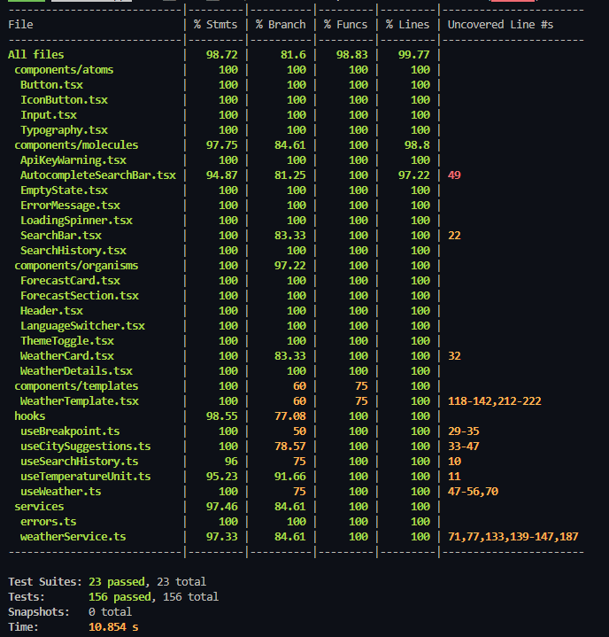

# Weather App

Aplicación web para consultar el clima actual de cualquier ciudad del mundo. Construida con Next.js 16, TypeScript, MUI 7 e integración con la API de OpenWeatherMap.

## Características

- Búsqueda de clima actual por nombre de ciudad
- Conversión de temperatura entre Celsius y Fahrenheit
- Internacionalización (Español e Inglés)
- Modo claro y oscuro
- Historial de búsquedas
- Cancelación automática de requests obsoletos
- Accesibilidad (ARIA labels, roles semánticos)
- Cobertura de tests de 81.6% en branches

## Requisitos Previos

- Node.js 18 o superior
- npm 9 o superior
- API Key de OpenWeatherMap (gratuita en https://openweathermap.org/)

## Instalación

```bash
git clone <repo-url>
cd weather-app
npm install
```

## Configuración

1. Copia el archivo de ejemplo:
```bash
cp .env.example .env.local
```

2. Edita `.env.local` con tu API Key de OpenWeatherMap:
```
NEXT_PUBLIC_OPENWEATHER_API_KEY=tu_api_key_aqui
```

## Ejecución

**Modo desarrollo:**
```bash
npm run dev
```
La aplicación estará disponible en http://localhost:3000

**Build de producción:**
```bash
npm run build
npm start
```

**Formatear código:**
```bash
npm run format
```

## Tests

**Ejecutar todos los tests:**
```bash
npm test
```

**Modo watch:**
```bash
npm run test:watch
```

**Con reporte de cobertura:**
```bash
npm run test:coverage
```

### Cobertura de Tests

| Métrica | Cobertura |
|---------|-----------|
| Statements | 98.72% |
| Branches | 81.6% |
| Functions | 98.83% |
| Lines | 99.77% |

- 23 suites de tests
- 156 tests (todos pasan)
- Tiempo promedio: ~11 segundos



## Estructura del Proyecto

```
src/
├── app/[locale]/              # Páginas y layout
├── components/
│   ├── atoms/                 # Componentes básicos
│   ├── molecules/             # Componentes compuestos
│   ├── organisms/             # Componentes complejos
│   └── templates/             # Layouts de página
├── hooks/                     # Custom hooks
├── services/                  # Lógica de negocio y API
├── config/                    # Configuración
├── i18n/                      # Internacionalización
├── messages/                  # Traducciones
├── theme/                     # Temas de UI
├── types/                     # Tipos TypeScript
└── __tests__/                 # Tests unitarios e integración
```

## Tecnologías Principales

- Next.js 16
- React 19
- TypeScript 5
- MUI 7
- next-intl (internacionalización)
- next-themes (tema claro/oscuro)
- Axios
- Jest y React Testing Library
| **Prettier** | 3 | Formateo de código |
| **ESLint** | 9 | Linting |